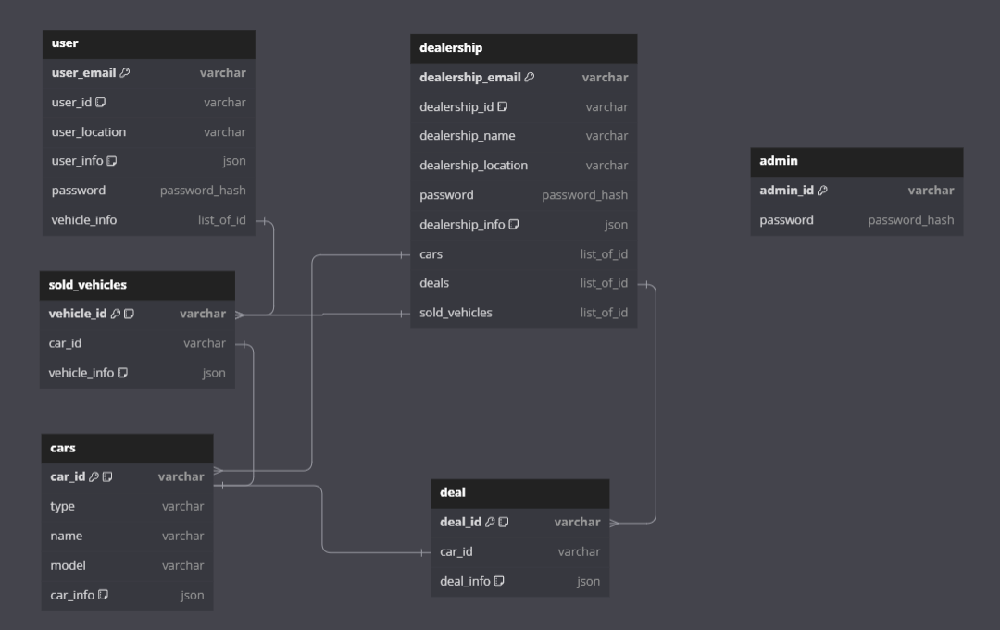

  <h1>User Model</h1>

  
This repository contains the Mongoose User model for managing user data in a MongoDB database.

  <h2 id="description">Description</h2>

  
The User model is designed to represent user data in a MongoDB database using Mongoose. It provides a schema for defining the structure of user documents and includes middleware functions for hashing passwords before saving them to the database.

  

  <h2 id="features">Features</h2>
  <ul>
    <li>Defines a schema for user documents</li>
    <li>Automatically generates a unique user ID</li>
    <li>Hashes passwords before saving them to the database</li>
    <li>Supports referencing vehicle information stored in the SolidVehicle model</li>
  </ul>
